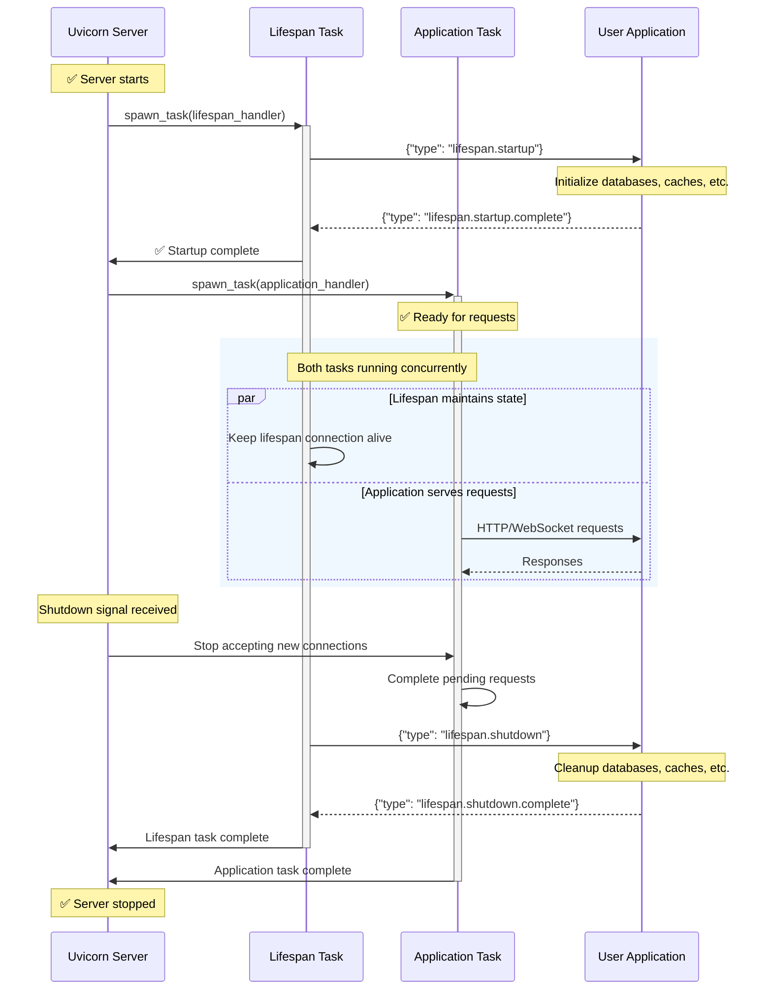

Since Uvicorn is an ASGI server, it supports the
[ASGI lifespan protocol](https://asgi.readthedocs.io/en/latest/specs/lifespan.html).
This allows you to run **startup** and **shutdown** events for your application.

The lifespan protocol is useful for initializing resources that need to be available throughout
the lifetime of the application, such as database connections, caches, or other services.

Keep in mind that the lifespan is executed **only once per application instance**. If you have
multiple workers, each worker will execute the lifespan independently.

## Lifespan Architecture

The lifespan protocol runs as a sibling task alongside your main application, allowing both to execute concurrently.

Let's see how Uvicorn handles the lifespan and main application tasks:



Having the lifespan task run as a sibling task is a deliberate design choice. It could have been implemented as a parent task that spawns the
application task. This decision has the implication that if you create a [`ContextVar`][contextvars.ContextVar]
in the lifespan task, it will not be available in the application task.

## Usage

Let's see an example of a minimal (but complete) ASGI application that implements the lifespan protocol:

```python title="ASGI application with lifespan" hl_lines="3-11"
async def app(scope, receive, send):
    if scope['type'] == 'lifespan':
        while True:
            message = await receive()
            if message['type'] == 'lifespan.startup':
                print("Application is starting up...")
                await send({'type': 'lifespan.startup.complete'})
            elif message['type'] == 'lifespan.shutdown':
                print("Application is shutting down...")
                await send({'type': 'lifespan.shutdown.complete'})
                return
    elif scope['type'] == 'http':
        await send({
            'type': 'http.response.start',
            'status': 200,
            'headers': [(b'content-type', b'text/plain')],
        })
        await send({'type': 'http.response.body', 'body': b'Hello, World!'})
    else:
        raise RuntimeError("This server doesn't support WebSocket.")
```

You can run the above application with `uvicorn main:app`. Then you'll see the print statements when the
application starts. You can also try to send some HTTP requests to it, and it will respond with "Hello, World!".
And if you stop the server (`CTRL + C`), it will print `"Application is shutting down..."`.

## Disabling Lifespan

If you want to disable the lifespan protocol, you can do so by setting the `lifespan` option to `off` when running Uvicorn:

```bash
uvicorn main:app --lifespan off
```

By default, Uvicorn will automatically enable the lifespan protocol if the application supports it.
