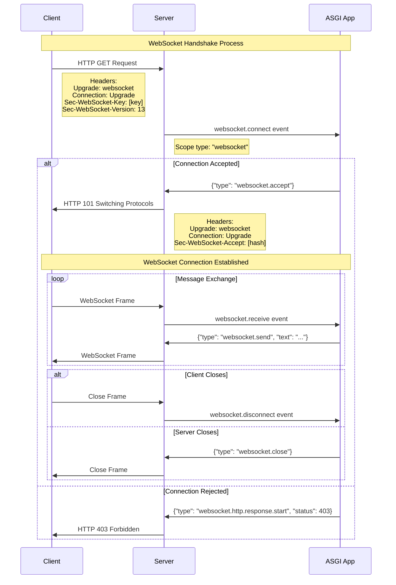

**Uvicorn** supports the WebSocket protocol as defined in [RFC 6455](https://datatracker.ietf.org/doc/html/rfc6455).

## Upgrade Process

The WebSocket protocol starts as an HTTP connection that gets "upgraded" to a WebSocket connection
through a handshake process. Here's how it works:

1. **Initial HTTP Request**: The client sends a regular HTTP GET request with special headers indicating it wants to upgrade to WebSocket:
    - `Upgrade: websocket`
    - `Connection: Upgrade`
    - `Sec-WebSocket-Key`: A base64-encoded random key
    - `Sec-WebSocket-Version: 13`

2. **Server Processing**: Uvicorn receives the request and creates a WebSocket scope, sending a `websocket.connect` event to the ASGI application.

3. **Application Decision**: The ASGI app decides whether to accept or reject the connection based on authentication, authorization, or other logic.

4. **Handshake Completion**: If accepted, the server responds with HTTP 101 status and the computed `Sec-WebSocket-Accept` header.

5. **Full-Duplex Communication**: Once upgraded, both client and server can send messages at any time using WebSocket frames.

6. **Connection Termination**: Either side can initiate closing the connection with a close frame.

## ASGI WebSocket Events

**Uvicorn** translates WebSocket protocol messages into ASGI events:

- `websocket.connect`: Sent when a client requests a WebSocket upgrade
- `websocket.receive`: Sent when a message is received from the client
- `websocket.disconnect`: Sent when the connection is closed

The ASGI app can respond with:

- `websocket.accept`: Accept the connection upgrade with an optional subprotocol
- `websocket.send`: Send a message to the client
- `websocket.close`: Close the connection with an optional status code

You can read more about it on the [ASGI documentation](https://asgi.readthedocs.io/en/latest/specs/www.html#websocket).

## Protocol Implementations

**Uvicorn** has three implementations of the WebSocket protocol.

### WSProto Protocol

This implementation was the first implemented. It uses the
[`wsproto`](https://python-hyper.org/projects/wsproto/en/stable/) package underneath.

You can choose this protocol by setting the `--ws` option to `wsproto`.

### WebSocket Protocol

This implementation uses the [`websockets`](https://websockets.readthedocs.io/) package as dependency.

By default, if you have `websockets` installed, Uvicorn will use this protocol.

### WebSockets SansIO Protocol

Since `websockets` deprecated the API Uvicorn uses to run the previous protocol, we had to create this new
protocol that uses the `websockets` SansIO API.

You can choose this protocol by setting the `--ws` option to `websockets-sansio`.

!!! note
    The SansIO implementation was released in Uvicorn version 0.35.0 in June 2025.
