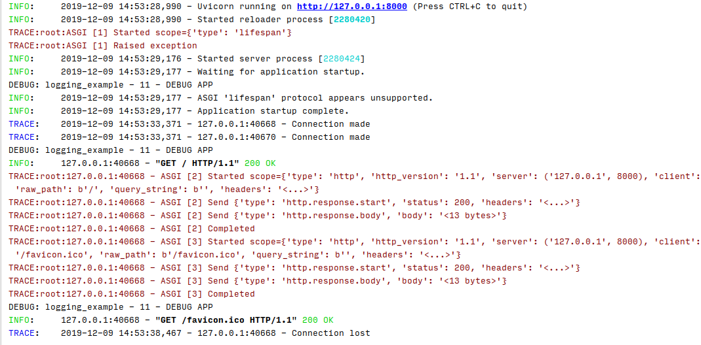

# Examples

## Custom logging

The below `logging_example.yaml` overrides the default logging configuration using the `--log-config` flag.

It makes use of the `uvicorn.error` and `uvicorn.access` colorized loggers with to the `use_colors` key in the formatters section.

It also makes use of the `TRACE` output with the `--log-level` flag and setup a debug logger on the `logging_example.py`.



```yaml hl_lines="7 11 38 39 40 41"
{!./src/logging_example/logging_example.yaml!}
```

in your `logging_example.py`

```python hl_lines="7 32"
{!./src/logging_example/logging_example.py!}
```
